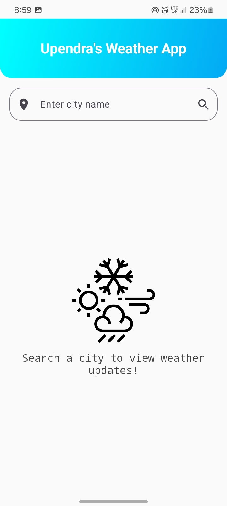
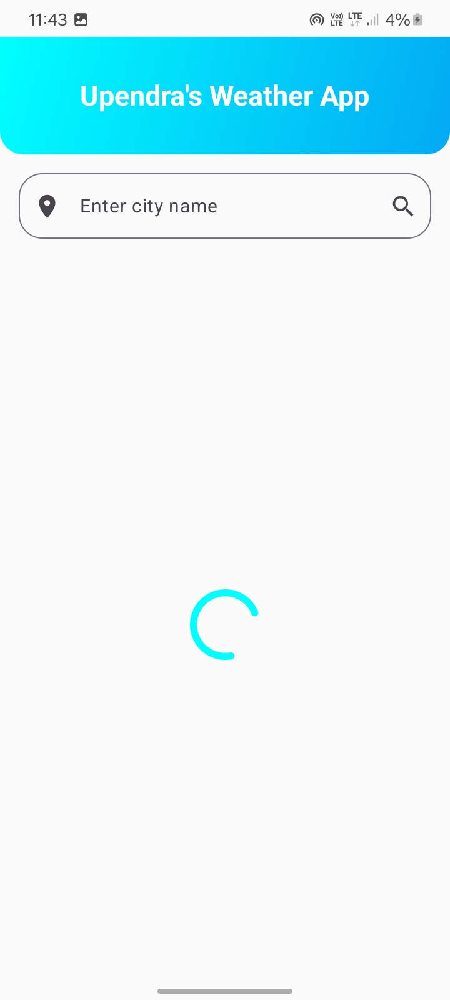
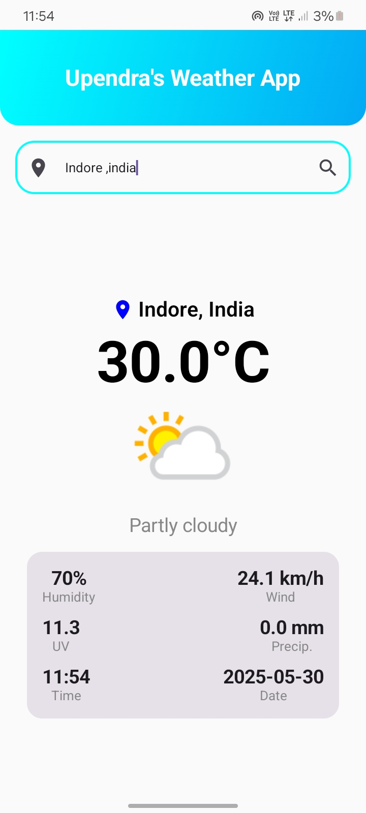
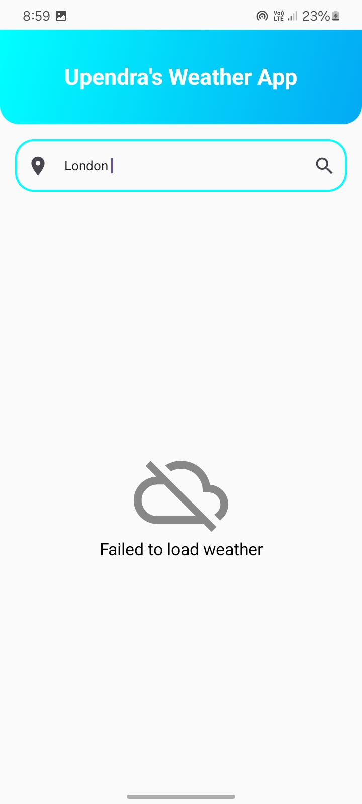

# ☀️ Weather App – Android Application

Welcome to the Weather App for Android! This elegant and user-friendly app provides real-time weather conditions for any city worldwide. Built with **Kotlin** and **Jetpack Compose**, it features a clean, modern interface and smooth performance.

---

## 🧩 About the Project

The Weather App delivers accurate, up-to-date weather information via a reliable external API. Key features include city search, detailed weather metrics, and dynamic weather icons.

### 🛠️ Technologies Used

- **Kotlin** (Android development)
- **Jetpack Compose** (Modern UI toolkit)
- **Retrofit** (API integration)
- **Gson** (JSON parsing)
- **MVVM Architecture**
- **ViewModel & State Management**
- **Material Design Components**

---


## ⚡ Features

- **City Search:** Find weather by city name.
- **Real-Time Data:** Temperature, humidity, wind speed, and more.
- **Responsive UI:** Optimized for all screen sizes.
- **Minimal Design:** Clean, distraction-free interface.
- **Lightweight & Fast:** Efficient performance.
- **Dynamic Weather Icons:** Visual cues for weather conditions.
- **API Key Configuration:** [Instructions here if needed]

---

## 📸 Screenshots

| Starting | Loading | Success | Error |
|----------|---------|---------|-------|
|  |  |  |  |

---
## 🛠️ Technologies Used

- **Kotline** (Android Development)
- **Jetpack Compose** (UI Design)
- **Retrofit** (Database for storing tasks)
- **MVVM** (For displaying tasks)
- **Material Design Components**

## 📂 Project Structure

```
WeatherApp/
│
├── data/                        # Data sources: local (Room), remote (API), and models
│   ├── local/
│   │   ├── WeatherDao.kt            # DAO interface for Room
│   │   └── WeatherDatabase.kt       # Room database class
│   ├── model/
│   │   ├── WeatherResponse.kt       # Data class for API response
│   │   └── WeatherEntity.kt         # Data class for Room entity
│   ├── remote/
│   │   ├── WeatherApi.kt            # Retrofit API interface
│   │   └── RetrofitInstance.kt      # Retrofit builder
│
├── domain/                     # Business logic layer (recommended for Clean Architecture)
│   ├── model/
│   │   └── Weather.kt              # Domain model (optional, for mapping)
│   ├── repository/
│   │   └── WeatherRepository.kt    # Repository interface (domain contract)
│   └── usecase/
│       └── GetWeatherUseCase.kt    # Use case for fetching weather data
│
├── repository/                 # Data implementation of repositories
│   └── WeatherRepositoryImpl.kt    # Implements domain repository, combines local + remote
│
├── ui/                         # UI layer (Jetpack Compose screens, components, themes)
│   ├── components/                 # Reusable composables (cards, buttons, etc.)
│   ├── screens/
│   │   ├── HomeScreen.kt           # Shows weather details
│   │   ├── SearchScreen.kt         # City search UI
│   │   └── DrawerScreen.kt         # Navigation drawer
│   └── theme/                      # Material theme, colors, typography
│
├── viewmodel/
│   └── WeatherViewModel.kt         # ViewModel for UI state management
│
├── utils/
│   ├── Constants.kt                # Constants (API keys, URLs, etc.)
│   ├── Extensions.kt               # Extension functions
│   └── NetworkUtils.kt             # Network status helpers (optional)
│
├── di/                             # Dependency injection (if using Dagger/Hilt/Koin)
│   └── AppModule.kt
│
├── resources/
│   ├── images/                     # App images, icons, etc.
│   └── screenshots/                # Screenshots for documentation
│
├── MainActivity.kt                 # App entry point, sets up navigation
├── build.gradle
└── AndroidManifest.xml

```
### 📥 Direct APK Download:
Click below to download the latest version of the APK directly:

➡️ **[Download APK](https://github.com/upend123/Weather-app/releases/download/v1.0/weather_app.apk)**

### 🚀 Running the App Locally (Android Studio):
1. Clone the repository:
   ```bash
   git clone https://github.com/upend123/Weather-app.git
   ```
2. Open the project in **Android Studio**.
3. Connect your Android device or start an emulator.
4. Click on **Run** ▶️ to install and launch the app.

---

## 📜 License
This project is licensed under the **MIT License** – you're free to use and modify it.

💡 **Suggestions & Contributions are Welcome!** Feel free to submit issues and pull requests to improve the project.

---

💡 **Developed by [Upendra Yadav]**

